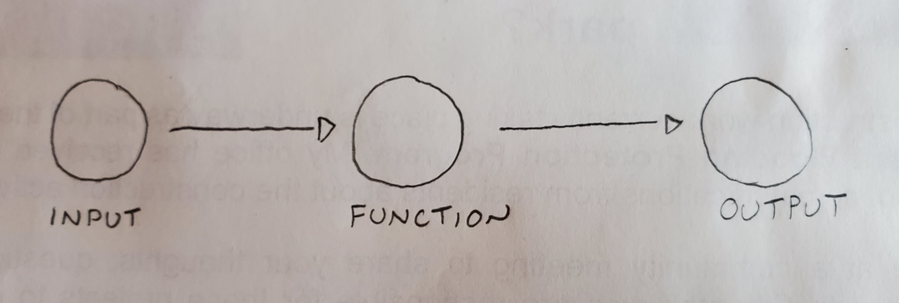

## Welcome to my Neural Net Tutorial

_March 16 2020_

My name is Lee Hulse-Smith, and I'm a Full Stack Software Developer at the Centre of Forensic Sciences in Toronto, Canada. 

I became interested in neural networks a few years ago following the autonomous driving work being done by Tesla, Waymo, and Uber.

The purpose of this tutorial is to track my own progress and centralize resources as I learn about neural networks. But if this helps you too, then bonus!

My main resource for learning will be the [Convolution Deep Learning For Visual Recognition](http://cs231n.stanford.edu/) taught by [Andrej Karpathy](https://cs.stanford.edu/people/karpathy/). All of the [2016 course content](https://www.youtube.com/playlist?list=PLkt2uSq6rBVctENoVBg1TpCC7OQi31AlC) is available free online.

Also, becuase I learn best by doing, my plan is to build a neural network in Javascript using the [MNIST database](http://yann.lecun.com/exdb/mnist/) collection of 60,000 handwitten integers between 0 and 9 to train and test the network.

## Introduction

What is a neural network, and when would you want to use one? Let's start with the following [xkcd](https://xkcd.com/) comic. 

Here we have two problems that our programmer is being asked to solve. The first one is relatively easy, since most photos contain geological information embedded in the image. The second one is bordering on insane. How would you go about writing a program that could "read" an image and tell you it contains a bird. It's easy for us to look at an image and carry out this task. But to a computer, each image is just a grid of numbers, each number representing a pixel intensity. Writing a program that can read these numbers over multiple images and somehow know which numbers represent a bird, and which do not, is virtually impossible.

Or is it? 

Enter neural networks, which are very good at solving very difficult questions.

Okay, fair enough, but what ARE neural networks?

Technically, they represent a collection of interconnected decision pathways which work together through a probabilistic model to categorize complex input data. But what the hell does that mean? Well, when we look at a picture, we don't have any problems telling if it contains a bird. Sure, there might be some images that cause some issues for us, but for the most part we don't have any problems with this very complex task. This tells us something very important. That while the task may be complex, it is not impossible, and that there DOES exist an algorithm that can do the job...it's just that discovering that algorithm is virtually impossible. So instead of designing this algorithm, what if there was a way to discover it instead? This is basically what a neural network does...it uses example data which has been labelled with the correct answers to discover the best algorithm to successfully identify future data.

Okay, let's back up, because this is getting a little more abstract than I wanted...and it doesn't really answer the questions about what a neural network is. So let's slowly build a small one up from scratch and see if that does a better job.

## Convolution Neural Network - The Beginning

Before we dive in, it's important to know that there are [many types](https://towardsdatascience.com/the-mostly-complete-chart-of-neural-networks-explained-3fb6f2367464) of neural networks, but we are going to concentrate on a type of deep feed forward (DFF) neural network that represents an excellent baseline for understanding how they all work.

So let's dive in!

We're going to build something very simple that works from beginning to end, then we're going to start layering on top of that.

