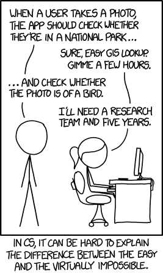
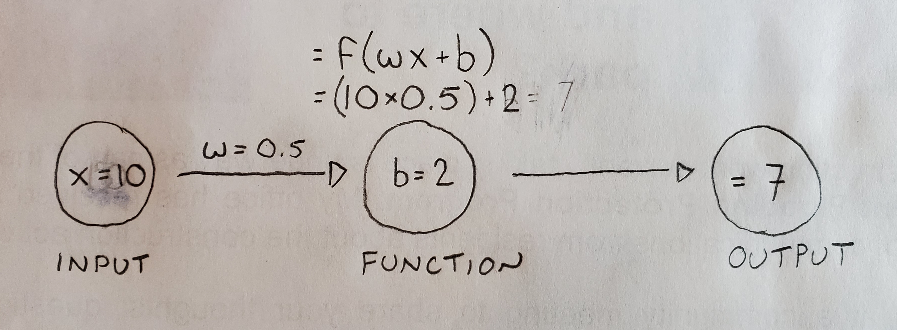

## Welcome to my Neural Net Tutorial

_March 16 2020_

My name is Lee Hulse-Smith (aka Independent Variable :) ), and I'm a Full Stack Software Developer at the Centre of Forensic Sciences in Toronto, Canada. 

I became interested in neural networks a few years ago following the autonomous driving work being done by Tesla, Waymo, and Uber.

The purpose of this tutorial is to track my own progress and centralize resources as I learn about neural networks. But if this helps you too, then bonus!

My main resource for learning will be the [Convolution Deep Learning For Visual Recognition](http://cs231n.stanford.edu/) taught by [Andrej Karpathy](https://cs.stanford.edu/people/karpathy/). All of the [2016 course content](https://www.youtube.com/playlist?list=PLkt2uSq6rBVctENoVBg1TpCC7OQi31AlC) is available free online.

Also, becuase I learn best by doing, my plan is to build a neural network in Javascript using the [MNIST database](http://yann.lecun.com/exdb/mnist/) collection of 60,000 handwitten integers between 0 and 9 to train and test the network.

## Introduction

What is a neural network, and when would you want to use one? Let's start with the following [xkcd](https://xkcd.com/) comic. 

Here we have two problems that our programmer is being asked to solve. The first one is relatively easy, since most photos contain geological information embedded in the image. The second one is bordering on insane. How would you go about writing a program that could "read" an image and tell you it contains a bird. It's easy for us to look at an image and carry out this task. But to a computer, each image is just a grid of numbers, each number representing a pixel intensity. Writing a program that can read these numbers over multiple images and somehow know which numbers represent a bird, and which do not, is virtually impossible.

Or is it? 

Enter neural networks, which are very good at solving very difficult questions.

Okay, fair enough, but what ARE neural networks?

Technically, they represent a collection of interconnected decision pathways which work together through a probabilistic model to categorize complex input data. But what the hell does that mean? Well, when we look at a picture, we don't have any problems telling if it contains a bird. Sure, there might be some images that cause some issues for us, but for the most part we don't have any problems with this very complex task. This tells us something very important. That while the task may be complex, it is not impossible, and that there DOES exist an algorithm that can do the job...it's just that discovering that algorithm is virtually impossible. So instead of designing this algorithm, what if there was a way to discover it instead? This is basically what a neural network does...it uses example data which has been labelled with the correct answers to discover the best algorithm to successfully identify future data.

Okay, let's back up, because this is getting a little more abstract than I wanted...and it doesn't really answer the questions about what a neural network is. So let's slowly build a small one up from scratch and see if that does a better job.

## Convolution Neural Network - The Beginning

Before we dive in, it's important to know that there are [many types](https://towardsdatascience.com/the-mostly-complete-chart-of-neural-networks-explained-3fb6f2367464) of neural networks, but we are going to concentrate on a type of deep feed forward (DFF) neural network that represents an excellent baseline for understanding how they all work.

So let's dive in!

We're going to build something very simple that works from beginning to end, then we're going to start layering on top of that to create a working neural network.

Below is a basic diagram showing some circles connected with arrows. We're going to call the circles "nodes" and the arrows "edges". So we have input, function, and output nodes, and two edges connecting them together.

In this example, our input node will be a single number, which we will send over to the function node where we'll get all mathematical on it, the output of which we will send over to the output node. So far so good? Let's plug in some numbers to make this a little less abstract...

So here out input node has a value of 10, and we're going to use two variables to transform it. The first is the weight (w=0.5) and notice that I've placed this variable on the edge arrow between the input and function node. This will become important later. Next we have a bias (b=2) which I've placed inside the function node. And finally, let's use all these new friends to transform our input variable =(w10)+b  =(0.5)(10)+2  = 7. And finally, let's send that final value (7) over to our output node where it will sit there happy and content.

But it is not happy. Because we know that the output is supposed to be 3, not 7, and now we need to adjust things so that we get the right output. But what do I mean that "the output is supposed to be 3"? Okay, let me back up for a second. When we first initialize a neural network, it's dumb....doesn't know a damn thing...which means we have to train it. And you can't train it unless you know what the right answer is suppossed to be. Let's go back to image recognition of birds as an example. At some point we're going be plugging images into our neural network, and our output will either be "bird" or "no bird". But at the beginning the system is dumb and it needs us to tell it the answer so it can adjust it's inner settings to get itself closer to the right answer.

Which leads us to something called "back propogation"

## Back Propogation

So we have an output value of 7, but we know the TRUE value is 3, and we have access to two variables (weight and bias) that we can tweak to get us there. Now we could just change the weight to 0.1, leave the bias where it is, and we're done! Well, that would work here with just three nodes, but very soon we are going to be dealing with hundreds of interconnected nodes, and eyeballing it like that just isn't going to work. So let's come up with a more mathematical way to adjust our weight and bias now, so we're in a better position moving forward.

First we need to calcualte how far off our current value is. That's pretty easy, we have 7 and we want 3, so we're off by 4. But once again, we need to get ourselves prepared for when the problem we are trying to answer is a little more complex than this. So let's add a few more input values to play with. Below is a list of 5 input values, along with their associated Output and Desired (True) values

|Input     |Output    |Desired
|----------|----------|----------
|  10      |  7       |  3
|  14      |  9       |  3.8
|  22      |  13      |  5.4
|  2       |  3       |  1.4
|  102     |  53      |  21.4 

So now it's a little less clear what our weight and bias should be for all these input values. That said, you could probably figure it out, but that's because there is a direct linear relationship between the Input and Desired values. That will not be the case when we start to scale up. In fact, this is the whole reason why we would use a neural network...to uncover non-linear relationships.

Okay, back to the problem at hand. Now we have these five inputs, but let's feed them into our neural network one at at time to understand how this works. 

We need to calculate the error between the Output and Desired, but lets also do two extra things. Lets also calculate the ABSOLUTE error, and then let's SQUARE the error, and see what we have.

|Input     |Output    |Desired   |Abs Error | Sq Error
|----------|----------|----------|----------|----------
|  10      |  7       |  3       |  4       |  16
|  14      |  9       |          |          |  
|  22      |  13      |          |          |  
|  2       |  3       |          |          |  
|  102     |  53      |          |          |  

Okay, why did we do that?. First, by looking at the ABSOLUTE error, we get rid of any negative errors, which helps us normalize how big or small each error is. If we have two error values of -10 and +10, these two values both tell us that the output is 10 units away from the desired output, so by taking an absolute value, we place all error values on the same side of the zero. Next, if we square these error values, we amplify how far away from the desired output we are. For this input, our Square Error is only jumps from 4 to 16....but in the last row we're going to see that same jump go from 21 to 466. Basically, we're making larger error stand out more.

## Differentiation

Okay, the name of the game now is to use our training data, the Inputs, to slowly nudge our weight and bias value in the proper direction. To do this, we're going to make a very small change to our weight and bias, and then figue out if that change was good.

Let's start with the weight....let's see what happens to the Sq Error if we change it from w=0.5 to w=0.501.

|Input     |Output    |Desired   |Abs Error | Sq Error(w=3) | Sq Error(w=.501)
|----------|----------|----------|----------|---------------|-----------------
|  10      |  7       |  3       |  4       |  16           | 16.0801
|  14      |  9       |          |          |               | 
|  22      |  13      |          |          |               |
|  2       |  3       |          |          |               |
|  102     |  53      |          |          |               |

Now let's back up and reset out w back to 0.5, but change our bias to 2.01

|Input     |Output    |Desired   |Abs Error | Sq Error(b=2) | Sq Error(b=2.01)
|----------|----------|----------|----------|---------------|-----------------
|  10      |  7       |  3       |  4       |  16           | 16.0801
|  14      |  9       |          |          |               | 
|  22      |  13      |          |          |               |
|  2       |  3       |          |          |               |
|  102     |  53      |          |          |               |

In both cases, our Square Error value has increased slighly, which would suggest that we should decrease both our weight and bias values if we want to increase the fitness of our neural network to the problem at hand. 

But we can do this calculation a little bit better using derivatives, or in other words, by examining the rate of change towards to right value for this particular weight and bias adjustment.

So for the weight, we increaed it by 0.001, and this resulted in a Square Error difference of 0.801. Divide 0.801 by 0.001 and we get an 801x rate of change. This gives us more information. First, the rate of change is positive, which tells us we need to decrease our weight...but we already knew that. Second, it gives us some idea of how far away we are from an ideal weight value, becuase as we get closer, this rate of change will start to decrease until we hit a zero mark.

If we do the same thing for our bias, we get an 80.1x rate of change. It is also a positive value so we need to decreate our bias, and the rate of change is less than it was for the weight, implying that perhaps our current bias value is not as far off from an ideal value as our weight currently is.

From here we could adjust our weight and/or bias and run the second Input, rinse/repeat, and slowly over many Inputs our function will reach a steady state where our weight and bias derivative is zero, and we now have a pretty well trained, albiet very simple, neural network.

## Non Linear Modeling

